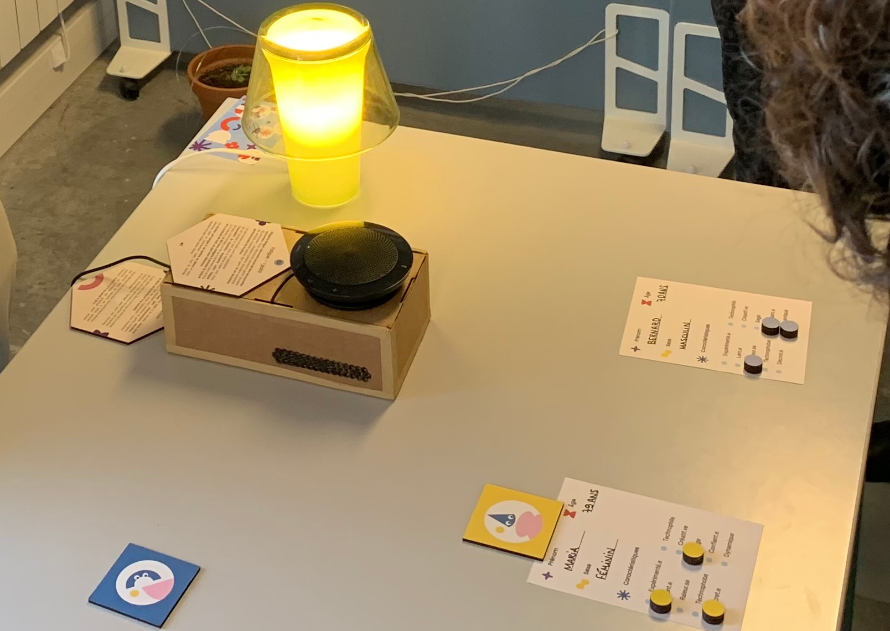

# 🧑‍🦳 Agisme

- [🧑‍🦳 Agisme](#-agisme)
  - [🗒 Prérequis](#-prérequis)
  - [🚀 Démarrage rapide](#-démarrage-rapide)
  - [🚴 Utilisation](#-utilisation)
  - [❤️ Contributeurices](#️-contributeurices)

## 🗒 Prérequis
- Un lecteur RFID 
- Un haut-parleur
- Des cartes RFID
- Un ordinateur avec [processing](https://processing.org/download/) installé

## 🚀 Démarrage rapide

Lancez le programme `rfid_son.pde` avec Processing.

## 🚴 Utilisation

Déposer une carte RFID sur le lecteur pour entendre un son.

## ❤️ Contributeurices
Anthony Couret